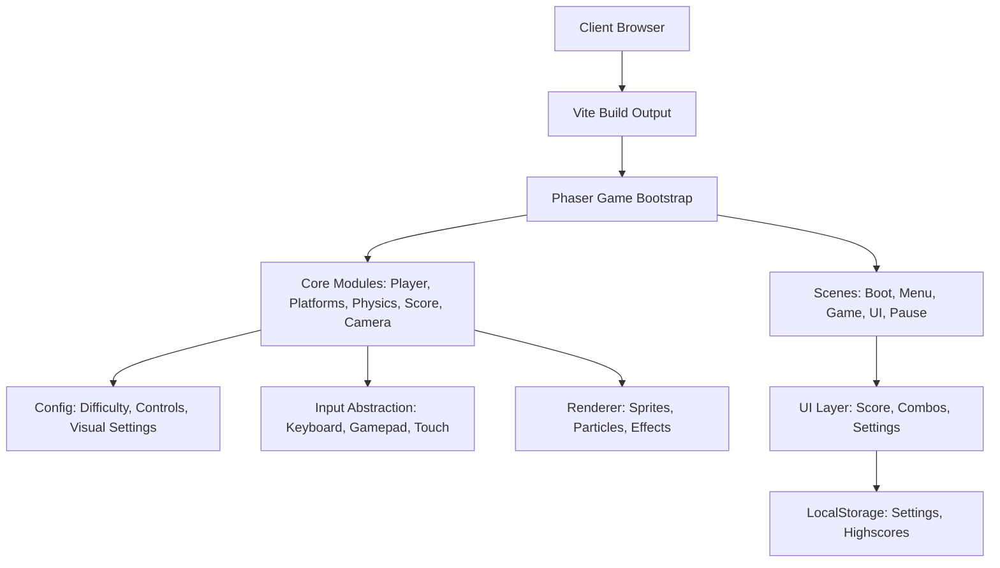

# Projektplan: BiesyTower (Web)

Ziel: Ein modernes, visuell ansprechendes BiesyTower-Remake als Browser-Game (primär Desktop), mit sauberer Mobile-Unterstützung, das alle Kernfunktionen und Eigenschaften des Originals enthält und diese sinnvoll erweitert, ohne den Charakter zu verlieren.

---

## 1. Zielbild und Kernanforderungen

### 1.1. Core-Gameplay (Feature-Parität zum Original)

Das Spiel muss mindestens:

- Vertikales Jump&Run in einem endlosen Turm
- Präzise, responsive Steuerung
- Wand-Sprünge / Kombos / Streaks
- Unterschiedliche Plattformtypen (statisch, beweglich, rutschig, zerbrechlich)
- Highscore-System (lokal, optional später online)
- Charakter mit simplen Animationen (Idle, Run, Jump, Fall, Landen)
- Kamera, die nach oben scrollt; Tod, wenn der Spieler aus dem Screen fällt
- Menü, Pause, grundlegende Einstellungen

Diese Anforderungen sind Grundlage für Architektur und Technik.

### 1.2. Moderne Erweiterungen (ohne das Original zu „zerstören“)

- Moderner Look:
  - Glatte Animationen
  - Parallax-Hintergrund
  - Licht-/Schatteneffekte, dezente Partikel
  - Klare, lesbare UI (Score, Combos, Höhenmeter)
- UX:
  - Config: Tastenbelegung, Lautstärke, ggf. Farbschemata
  - Optionale Accessibility: reduzierte Effekte, Farbenblindheitsfreundliche Paletten
- Technik:
  - Stabile 60 FPS in modernen Browsern
  - Mobile-Unterstützung (angepasste Controls, UI-Skalierung, Touch-Steuerung)
- Erweiterbarkeit:
  - Später: Skins, zusätzliche Modi, Online-Leaderboards

---

## 2. Zielplattformen und Laufzeitumgebung

Ziel: Läuft in aktuellen Browsern.

- Desktop:
  - Chrome, Firefox, Edge, Safari
  - Ziel: 60 FPS bei FullHD
- Mobile:
  - Chrome Mobile, Safari iOS
  - Angepasste Steuerung (Buttons / Swipe), vereinfachte Effekte möglich
  
Deployment:

- Statisches Hosting (z.B. GitHub Pages, Netlify, Vercel)
- Automatisierter Build via CI

---

## 3. Technologie-Stack

Fokus: Sauber, wartbar, leicht zugänglich, gute Performance.

### 3.1. Programmiersprache

- TypeScript für das gesamte Game-Logic- und Rendering-Code:
  - Vorteil: Typensicherheit, klarer Domain-Code für Physik, Entities, States
  - Läuft nach Transpile als JavaScript im Browser

### 3.2. Rendering / Game-Engine

Empfehlung: Zwei mögliche Ansätze (Plan sieht primäre Wahl vor):

1) Primäre Empfehlung: Phaser 3
- Begründung:
  - Bewährt für 2D Browser-Games
  - Gute Unterstützung für Sprites, Animationen, Kameras, Physik, Input
  - Viele Ressourcen, stabiler Ecosystem
- Verwendung:
  - Szenen: Boot, MainMenu, Game, Pause, UI
  - Kamera-Follow mit weichem Tracking und Limits
  - Arcade Physics für einfache Kollisionen

2) Alternative: Eigenes Rendering mit HTML5 Canvas + Lightweight-Framework (z.B. Kontra.js) oder komplett Custom
- Nur wählen, wenn maximale Kontrolle und minimaler Overhead gewünscht.
- Höherer Implementierungsaufwand für Dinge, die Phaser schon löst.

Plan: Start mit Phaser 3, Architektur aber so gestalten, dass Kernmechaniken nicht hart an Phaser gekoppelt sind.

### 3.3. Framework / Projektstruktur

- Build-Setup:
  - Node.js (LTS, z.B. 20.x)
  - Bundler: Vite (schnell, einfach, TS-Support)
- Struktur:
  - src/
    - core/ (Game-Logic, Entitäten, Physik, Scoring)
    - scenes/ (Phaser-Szenen)
    - assets/ (Sprites, Sounds, Fonts)
    - ui/ (Ingame UI, Menüs)
    - config/ (Game-Settings, Difficulty-Curves)
  - public/
    - index.html
  - plan.md (dieses Dokument)
  - README.md

### 3.4. Styling / UI

- UI-Technologie:
  - In-Game: Phaser-Text/Bitmap-Fonts + UI-Elements
  - Optional für Menüs/Settings: HTML/CSS-Overlay
- Design-Richtlinien:
  - Klare Typografie (z.B. Pixel- oder Semi-Pixel-Font für Nostalgie, kombiniert mit moderner Lesbarkeit)
  - Farbpalette: kalte, „icy“ Blautöne, weiche Farbverläufe, dezente Glows
  - Einheitliche UI-Komponenten

### 3.5. Assets und Audio

- Grafik:
  - 2D-Sprites (Charakter, Plattformen, Effekte)
  - Parallax-Layer (Hintergrund, tiefer Turm, Lichter)
- Audio:
  - Hintergrundmusik (Loop)
  - SFX: Sprung, Landung, Combo, Game Over
- Technische Anforderungen:
  - Web-optimierte Formate (PNG/WebP, ggf. Spritesheets)
  - Audio: OGG/MP3 (Cross-Browser)

### 3.6. Abhängigkeiten (Initialer Vorschlag)

- Runtime:
  - "phaser"
- Dev:
  - "typescript"
  - "vite"
  - "eslint" + passende TS/JS-Plugins
  - "prettier"
  - Optional: "vitest" oder "jest" für Tests
- Optional:
  - "zod" für Config-Validierungen
  - "sass" oder "tailwindcss" für eventuelle HTML-Overlays

---

## 4. High-Level Architektur

Ziele:
- Saubere Trennung von Game-Logic und Framework
- Erweiterbar für Modi/Features
- Gut testbar

### 4.1. Kernmodule

- GameLoop/Scenes:
  - BootScene: Laden von Assets, Config
  - MenuScene: Hauptmenü, Auswahl, Einstellungen
  - GameScene: Hauptspiel, Kamera, Plattformen, Spieler, Scoring
  - UIScene oder HUD: Score, Combo, Höhe, FPS/Debug
  - PauseScene: Pauseoverlay

- Entities:
  - Player:
    - Zustände: Idle, Run, Jump, Double-Jump (falls genutzt), Wall-Jump, Falling
    - Input-Abstraktion (Keyboard, Gamepad, Touch)
  - Platform:
    - Basisklasse + spezialisierte Typen (statisch, moving, falling, breaking)
  - World/LevelManager:
    - Generierung der nächsten Plattformen abhängig von Höhe / Schwierigkeit
    - Scroll-Logik

- Systems:
  - Physics:
    - Nutzung von Phaser Arcade Physics, aber Parametrisierung in Config
  - Score/Combo:
    - Kombobasierte Punkte (z.B. je schneller von Plattform zu Plattform, desto höher der Multiplikator)
  - Camera:
    - Follow-Mechanismus, Dead-Zone, Smooth Movement
  - Input:
    - Abstraktionsschicht:
      - Desktop: Tastatur (z.B. A/D oder Pfeile + Space)
      - Mobile: Touch-Buttons / virtueller Joystick

---

## 5. Detaillierter Umsetzungsplan (Phasen)

### Phase 0: Projekt-Setup

Ziele:
- Basis-Struktur, lauffähiger Skeleton-Build

ToDos:
- Node-Projekt initialisieren
- Vite + TypeScript konfigurieren
- Phaser integrieren
- Grundgerüst:
  - index.html
  - Einstiegspunkt [`src/main.ts`](src/main.ts:1)
  - Einfache BootScene und GameScene, schwarzer Hintergrund, ein Platzhalter-Sprite
- ESLint/Prettier einrichten
- Basis README.md erstellen

### Phase 1: Core-Gameplay (Minimal Viable Game)

Ziele:
- Spielbar, Parität zu Grundmechanik des Originals ohne „Hübsch“

ToDos:
- Spielerbewegung:
  - Links/Rechts, Sprung, variable Sprungweite, konsistente Steuerung
- Plattform-System:
  - Vertikale Liste von Plattformen
  - Nachgenerieren, wenn Kamera nach oben wandert
- Kamera:
  - Verfolgt Spieler nach oben
  - Game Over, wenn Spieler unter Bildschirm
- Scoring:
  - Punkte nach Höhe + einfache Combo-Logik
- Basic UI:
  - Anzeige von Score und Höhe
- Game Over Screen:
  - Neustart, zurück ins Menü

### Phase 2: Polishing der Mechaniken

Ziele:
- Feintuning, damit es sich gut anfühlt

ToDos:
- Sprungphysik justieren, bis sich das Spiel präzise und „snappy“ anfühlt
- Plattformvarianten (beweglich, unterschiedlich breit)
- Einführung von Combo-System:
  - Schnelle Sprünge, Wände, ggf. Anzeigen von Multiplikatoren
- Partikel bei Sprüngen und Landungen
- Tests:
  - Unit-Tests für Kernlogik (Score, Combo, Level-Generator)
  - Manuelles Playtesting

### Phase 3: Visual Design & Modernisierung

Ziele:
- Moderner, hochwertiger Look

ToDos:
- Finales Visual Styleguide definieren:
  - Farben, Typografie, Icon-Set
- Neue Assets:
  - Charakter-Sprites (Idle, Run, Jump, Land, Special)
  - Plattform-Design (Eis, Metall, Lichtkanten)
  - Parallax-Hintergrund
- Effekte:
  - Light-Glow, dezente Trails, Snow/Particle-Effekte
- UX:
  - Überarbeitete Menüs (Start, Settings, How-To-Play)
  - Sanfte Transitions (Fade, Slide)

### Phase 4: Mobile-Unterstützung

Ziele:
- Spiel gut spielbar auf Smartphones/Tablets

ToDos:
- Responsive Layout:
  - Skalierung von UI-Elementen
  - Anpassung von Kamera und sichtbarem Bereich bei kleineren Screens
- Touch Controls:
  - Einblendbare Buttons für Links/Rechts/Sprung oder
  - Gestensteuerung (z.B. links/rechts Screen-Hälfte)
- Performance-Optimierung:
  - Begrenzung von Partikeln auf schwächeren Geräten
  - Asset-Kompression

### Phase 5: Quality, Stabilität, Deployment

Ziele:
- Saubere, stabile, leicht wartbare Version online

ToDos:
- Error-Handling (Game-Fehler, Asset-Loading)
- Settings:
  - Lautstärke
  - Effekte an/aus
  - ggf. Tastenbelegung
- Highscores:
  - Lokal per LocalStorage
  - Optional: Backend-API-Anbindung für globale Leaderboards (später)
- CI/CD:
  - Automatischer Build und Deploy auf GitHub Pages / Netlify / Vercel
- Dokumentation:
  - Technische Architektur
  - Contribution Guide

---

## 6. Risiken und Architektur-Entscheidungen

- Performance:
  - Lösung: Frühzeitig Profiling, möglichst wenig Overdraw, effiziente Spritesheets
- Mobile Controls:
  - Solution: Separates Input-Abstraktionsmodul, konfigurierbar per Device
- Vendor Lock-in an Phaser:
  - Lösung: Gameplay-Logik (Score, Level-Generator, Rules) in eigenen TS-Modulen, nicht Phaser-spezifisch

---

## 7. Roadmap (Kurzfassung)

1. Setup: Tooling + Skeleton-Game
2. Core-Gameplay: Lauffähiger, spaßiger Prototyp mit Kernmechaniken
3. Polishing: Physik, Plattformen, Combos
4. Visual Redesign: Moderne Grafik, Effekte, UI
5. Mobile-Support: Controls, Responsive, Optimierung
6. Online-Stellung + Optionale Online-Features

---

## 8. Architektur-Übersicht (Mermaid)

Dieses Diagramm zeigt:
- Trennung zwischen Core-Logik, Darstellung und Input
- Erweiterbarkeit für spätere Features (z.B. Online-Backend)

---

## 9. Nächste Schritte

- Review dieses Plans
- Anpassung gemäß deinen Präferenzen (z.B. Stilrichtung, Schwierigkeitskurve, Komplexität des Combo-Systems)
- Danach: Übergabe an Code-Mode für:
  - Projektinitialisierung
  - Basis-Szenen und Core-Mechaniken